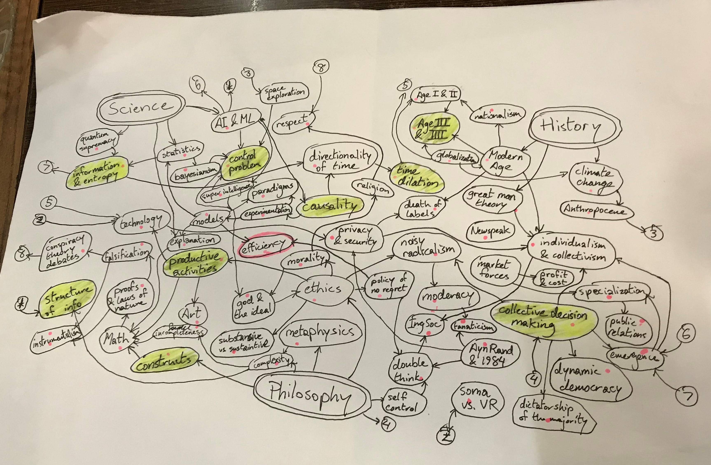
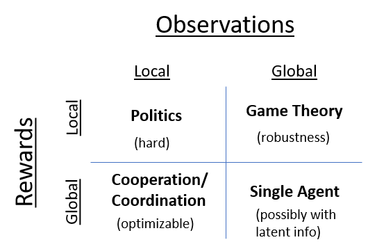

# Overview

- Foreword

    The English language is certainly not without its flaws. One such flaw that I would like to remedy, at least for my writings, is the lack of explicit distinction between the second person plural and singular pronouns (you vs you). Some use the slang "y'all" for the plural, however that is a bit to dialect-specific for me. Instead, I may occasionally use "yous" for the plural, instead of "you".

    Trying to define efficiency, optimality, suboptimal, etc.

## Full Course

- Philosophy Overview

    Start with Metaphysics as a foundation then work your way towards ethics using logic and aesthetics, with epistemology revealing itself along the way.

- Deep Metaphysics
    1. The Game - success as the ultimate goal
    2. True Reality - axioms and foundation
    3. Concepts - connection to language
    4. Practical Reality - observations and perception
- Functional Metaphysics
    1. Decisions - investigating concepts
    2. Models - decision making systems
    3. The Perfect World - Math & Logic
    4. Creativity & Explanation - ways to create new models
    5. Comparing Models - using science
    6. Principle of Statistics - logic in science
    7. Principle of Efficiency - aesthetics in science
    8. Knowledge - accumulating models
- Abstract Ethics
    1. Ethics - applying knowledge & making decisions
    2. Rationality - using scientific laws
    3. Irrationality - values, beliefs, & laws of nature
- Social Ethics
    1. Pragmatism - law & respect (authority)
    2. Culture & Traditions - morality
    3. Stability & Efficiency - science in society
    4. Human Nature - cooperation & trade
    5. Collectivism & Individualism - societal decisions
    6. Productivity & Entertainment - sustainability & consumption
    7. Technology & Engineering - learning vs doing
    8. Art & Aesthetics - instance of efficiency

## Ethics

- Sustaintive vs Substantive

    Balancing enjoying what we have and making progress

- Moderacy and Noisy Radicalism

    The dangers in the middle (and the danger's in the middle)

- Wheel of Productive Activities

    Science: creative and usable

    Art: creative and consumable

    Engineering: practical and usable

    Service: practical and consumable

    Math is suspiciously absent

- Collective Decision Making

    How can decisions be made by individuals that have differing perspectives and experiences.

    Arrow's theorems - show we have to be careful about what properties we must aim for in our decision making system

    Democracy as the most objective (least arbitrary) way to make decisions

- Dynamic Democracy

    A collective decision making system that scales to technology (communication and transportation) improving.

    Designing a collective decision making system for the information age? What aspects of direct democracy do we have to improve/adapt to make our decisions less biased?

- Calculus of Decisions

    A model is a way to make a specific decision.

    The change in our models over time is our knowledge.

    The change in our knowledge over time is our education.

    How to connect with the accumulation of our models being our knowledge?

- Foundations of Morality

- Fanaticism

    Including differentiating fanaticism and radicalism

## Philosophy of Science & Math

- Principle of Statistics & Efficiency

- Laws & Facts
- Mathematical Constructs

- Dealing in Absolutes and Relativism

    Be it morality, religion, or even the law - if you deal in absolutes you will make mistakes. This realization caused the AI Winter. 

    The world doesn't work in absolutes. Using them may appear to temporarily make things better, but long term it's always sub optimal. We can't guarantee ANY absolute, so using it incurs a risk that once accepted cannot be avoided. On the other hand, always using whatever strategy appears most promising at the time, allows for a policy of no regret.

- Making a convincing argument

    The more an argument challenges itself, the more convincing it becomes. Ayn Rand does not challenge her philosophy. Most main stream science does, especially along the lines of Popper.

    How do you debate? The purpose is not to convince the opponent - but to get a better understanding. Debates are still useful because it's easier to challenge some else because they think differently. The very inaccuracy and noisiness of communication actually makes it easier to challenge the argument being presented - case in point arguments seem much more reasonable in your head than when you articulate them.

- On purity, death, our species, the descendants thereof, and evolution by biological and other means

    The natural selection has produced an urge in us to want to live on. As we have not managed to adapt to our surroundings well enough that we can in principle live forever, individuals have a limited life span.

    Why do we want to survive (individually or by reproduction), why is that necessary? Why is that goal not misguided? - Strictly speaking, that goal is as arbitrary as any other. However, if that is not your goal, then eventually you will take some action that leads to your termination. At that point, you (the collective you) no longer have an effect on reality (that we know of). The only

    The ultimate goal: be able to reach any state that is desired. Based on our understanding of death, once you die (as an individual or a species), we no longer have any way to effect the state of the universe (to achieve whatever goal we choose). Therefore, death is not a very promising strategy for achieving our goal (whatever that is).

    This means in order to achieve our goal (whatever that is), we must survive, perhaps not as individuals but in whatever form we can manage.

    We are constantly changing (commonly referred to as evolving). So trying to preserve the "purity" (whatever is meant by that) of our species is nonsensical. You could of course draw some line in the sand and say we should not change so much as to cross it by whatever metric you choose, but then you are again dealing in an absolute - at some point it may be suboptimal not to cross that line, at which point your line causes suffering).

    Does the nature in which we survive forever matter? - No, that would be an absolute. Whatever strategy we decide to maximize the chances of our survival is what we should do, no matter the cost.

    What exactly constitutes our descendants? Is a watch I build my descendant? A robot? A sentience robot? A child I bear? My sibling? My nephew? My neighbor? My neighbor's child? Given that all our cells are replaced in the span of X years, me in X years? - Depending on our perspective (our culture) we may answer these questions differently.

    Example: If you (individual) could press a button to kill all humans, in return for some object, that is guaranteed to survive forever. Depending on the nature of the object, we might have to argue a little over what exactly "surviving" constitutes, but let's say whatever your requirements for survival you can imagine will be satisfied. Would you press the button? - Yes, I would press the button, because according to the arguments above, the best strategy I know of to achieve our highest goal is trying to maximize the chance of our descendants surviving. Allowing for the object in question to be our descendant, pressing the button would guarantee that we achieve the goal of survival. (Unfortunately (or perhaps fortunately, depending on your answer to the question), this decision is necessarily fictitious, as the premise involves us being aware of the absolute that the object will, in fact, survive forever).

- Omniscience and Omnipotence

    Knowing what goal to choose is as difficult of a problem as knowing how to achieve that goal. Therefore, omniscience is the same as omnipotence (or atleast if you have one, you have the other as well).

### Practical Analysis

- Collective decision making mechanisms

    Solving economics and politics one mechanism at a time

    - News feeds using reddit-like voting + personalization
    - use psych profile and or political/professional experience to recommend certain decisions
    - gofundme funding, but where large projects (or companies or labs) can have a tree structure and you can choose what level of the tree you want your money to go to
    - AI assistant to personalize news and auto vote on certain questions for you, send reminders, and possibly collate news for specific votes (using personality tests: big 5, myers-briggs, data from IPIP)
    - square root campaign donations (or general funding) - you only get a square root of the money you donate
    - trustworthiness of users comes from a page-rank like algorithm, maybe with an explicit trustworthiness balance so you can transfer trustworthiness points
    - for all decisions you can either vote on the decision or you can vote on another player to delegate your vote to that user.
    - users can create public polls or private polls, all have an end date
    - modding: can create and use custom filters to filter or highlight specific kinds of the messages (profanity, having a min level of trustworthiness)
    - decisions can be parameterized so users can customize their responses (eg. where should we build a bridge? can be answered with points on a map), dates, names, numbers can optionally be parameterized
    - freelance job search - basically looking for people to help with some project or work on something
- Fake News

    Making people angry sells - so fake news sells

    The money aspect of news

    Argument germs (from CGP Grey)

- Agency as an alternative to truth

    a good rule of thumb to quickly evaluate how "good" an argument is. It's faster, less philosophically murky, and more reliable (?) than evaluating arguments based on how "true" they are.

    for collective decision making, it can be useful for us to have a handful of key metrics we agree to use

    maximizing agency discourage black/white arguments - which seems like a good feature

    of course, there are lots of bad arguments that maximize agency, so this rule of thumb does not make the principles of statistics and aesthetics (ie. science) superfluous (neither does truth, and neither does any other metric), but it can be much faster to compare stories based on which one maximizes agency compared to which story is more true. (eg. given the argument "Candidate A won the election because people don't pay attention to/understand the news", if we use truth as our metric, we would have to go out and survey people to see how good of an argument that is, but this argument removes the agency of "people" so it's probably not a good argument.)

    problems with using truth as a metric:

    - Practical - whatever practical definition for the truth we use can be distorted/corrupted. Eg. videos → deep fakes, people's memory → suggestive wording to manipulate/distort people's memories (reference to unreliability of witness testimony).
    - Theoretical - since everybody experiences the world subjectively, we rely on language to connect different people's experiences. Language (and people's use of it) is obviously imperfect, which means while subjectively we might define "the truth" as being the precise sense experiences an individual had in a point in time, there is no precise way to reconcile one person's experience with that of another, so for collective decision making, truth isn't even well defined.
- Activism: Words, Actions, and Mechanisms

    Fighting words doesn't do much.

    Fighting actions works temporarily.

    To really change something, you have to fight mechanisms.

- Income Pools

    If the variance in your expected future income is large, then planning for the future is challenging. For example, professional athletes may end up getting very high paying contracts, or they may stay in relatively low paying teams.

    To decrease the variance in such situations, groups of people can form a group where any member of the group that earns more than some agreed amount of money (call it the cap)  pays a small amount to all other members of the group.

    The key point is that all the specifics (the cap, the percentage paid, circumstances of leaving the group) can be agreed upon by the members of the group. Additionally, as all members have to agree to accept each other member, both the size and the composition of the group is self-regulating.

    Encouraging such groups is potentially a very effective stepping stone to a self-regulating system to entirely determine everyone's income. This can also make it much easier to tax individuals as they can be taxed based on how much money is in their group. Tax incentives can be used to encourage groups to become larger, ie. the larger the group is, the lower the taxes are for all members in the group.

    Instead of every person being confined to a single group, they can have partial 

    One potential issue with this method, is that some members of the group may become complacent and lose motivation to work, especially if a few members of the group are already above their cap. This can be prevented by making sure that the amount collected by all members from the pot is sufficiently small, and that even if the pot is large, most of that money can stay invested, and only slowly gets distributed throughout the group.

## History

- Historical Time Dilation

    Including dealing with the emotional/human aspect - that doesn’t seem to dilate

- Introduction to Modernity

    The 19th century and a taste of globalization

- great man history

    What is the effect of an individual in history?

    Does the environment shape history through individuals, or do individuals take actions?

    Connect to Free Will

- Era III - Independence, Industrialization, and Imperialism

    An alternative (and ideally more global) perspective on the post-war world.

- Timeline of the Modern World

    [The Ages of Modernity](Overview/The%20Ages%20of%20Modernity.csv)

- The Information Age and Fake News

    Treating information in the information age. Currently, there is a fundamental change in how we think of and use information underway - on the scale of the Gutenberg printer. Movable type printing made information available for everyone, however it was not necessarily accessible. Therefore it was necessary to develop institutions that would share and disseminate information in a managable way. Now we are in the process of taking the next step in this evolution, as thanks to the internet, information is now becoming accessible for everyone. This means many of the institutions developed over centuries to collate and organize information are becoming streamlined and decentralized. This forces the traditional media outlets to compete not for quality and reliability of information (as the barrier to high quality information is now sufficiently low), but for attention - thereby causing the fake news phenomenon.

- Nationalism

    Starting in the enlightenment and the french revolution, accelerating with the unification of Germany and Italy and the birth of superpowers (in an industrialized world). The justification behind imperialism and domination. Boiling over in the Great War, which unfortunately didn't resolve much, and as a result people became only further entrenched in their beliefs. Perhaps the most apparent lesson to be learned by World War II, is that trusting in your country, and Meanwhile independence movements, often motivated by the very same principle, sparked additional tension and conflicts around the world. The next several decades especially, but continuing on even until today, it is this principle that has resulted in more suffering

    It's not a question of attributing blame or identifying those responsible, but rather about observing the same pattern over and over again, and not questioning the one principle common in every major tragedy in modern times.

    One might argue that the root cause is even deeper than nationalism and that nationalism is merely a common (and particularly destructive) form of fanaticism. However, there are two reasons to address nationalism before anything else: (1) it is relatively recent when compared to other fanatical beliefs such as religion so it is not as deeply ingrained in our culture, (2) unlike 

## Books and Sources

- 1984 Hypotheses

    At first Orwell's books may appear as a ham-fisted attack on Marxism and related ideologies, especially in the context of Leninism and the creation of the USSR. This would suggest that in function if not form Ayn Rand's works and Orwell's might be very similar.

    However, 1984 demonstrates a far greater understanding of Marxian class analysis theory and the central problem of class struggle proposed therefrom. In fact, 1984 describes a social system fully consistent with Marx's theory designed to refute Marx's solution, which is arguably inspired by some of the darker chapters of Stalin's regime.

    To demonstrate that Marx's system has a flaw, Orwell develops Ingsoc based on a concept of double-think. If we can believe that double-think is able to function in a society as Orwell describes, then Orwell has successfully demonstrated that something is missing in Marxian class analysis, in addition to introducing several other noteworthy mechanisms (Newspeak and its consequences, War is Peace, Ignorance is Strength, Freedom is Slavery).

- AR vs VR

    AR enhances our experiences, VR replaces them. In the context of creative activities: AR is the ultimate tool of science, and VR is the ultimate tool of art.

- Soma vs VR

    Soma as described in Huxley's Brave New World is a substance to produce a relaxed, happiness in users without any negative side-effects. Meanwhile, in the Unincorporated Man, fully immersive VR is described as the cause of the "Great Collapse" producing a society that instills a fear in VR to prevent such a collapse occuring again. VR and Soma have a very different effect on the societies that use them. Why? How are they different? What is the underlying mechanism/s?

- Atlas and I Shrugged

    Ayn Rand uses extremely strong and emotional language to illustrate certain virtues prescribed in the philosophy of Objectivism. The language of Atlas Shrugged leaves no room for argument or uncertainty, thereby making the work sound more like a very extensive propaganda piece, rather than a development and analysis of philosophical ideas.

- Vienna at the cusp

    Vienna Circle

    Stefan Zweig

    Der Mann Ohne Eigenschaften

    Physics? Germany

- Dan Carlin

## Programming

- Programming Language Philosophy

    The programmer is king. The programmer knows what they want to do and even how they want to do it. However in order to make the program a reality, the programmer must describe what and how to do things in a way that the computer understands. A compiler is a long list of rules that the programmer must abide by in their description. That doesn't make sense. It is not up to the compiler to decide whether the instructions by the programmer make sense or not. The only time the computer should complain is if it is unable to do what is asked of it, NOT if it thinks (due to primitive checks and optimizations) some operation doesn't make sense.

    Julia - separating data and logic - scripting with the functional paradigm

    Compare to MS Office spell check (notifying user when something is unexpected (spelling) without making changes) vs auto correct (making changes, and thereby also possibly annoying the user).

- Side causes

    just as a function can have side effects it can have side causes. The separation between data and functions should be strong. A function should not dictate where it gets data from (side-cause), and it should also not dictate which data is changed (side-effect). This is especially important for configuration managers. A function should not decide where, how, or why it gets certain config files. Instead the config files should define what config files are used/integrated and how they are merged → config inheritance aka config merging aka hierarchical configs.

## Information in Social Interactions

## Misc Ideas

- Profit vs Cost
- Innovation through competition

    How the reconcile the enormous waste of resources that comes with competition (war, deceit, advertising, etc.) with principle that "competition breeds innovation".

    A truly free market cannot work, and yet alternatives tend to get trapped in suboptimal attractors.

- God and the Ideal

- Art Hypothesis

    Aesthetics is merely a form of efficiency.

    The purpose of art is to be efficient.

- Dodging the Control Problem

    Is the control problem really a problem we have to worry about? Is a super intelligence dangerous?

    If you are omnipotent, is there a reason you would not grant a wish?

    If you are omnipotent, is there a reason you would not maximize the utility of everything around you?

- Be Bayesian

    The assumption that the world is not random is already too strong. Kolmogorov Complexity suggests the complexity of anything is entirely dependent on the language. So no matter what the apparent structure of the world is, there is always a language for which the observations cannot be compressed significantly - ie. they are completely random.

## Research

- Multi Agent Systems

    

    Swarms

    Emergent Behavior - inverse design, finding the

- Structure of information
- Learning Structured Representations